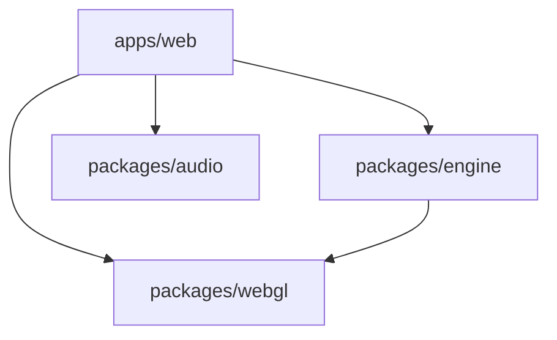

# WiggleDots Workspace

[](https://github.com/kassiomaia/wiggledots/actions/workflows/main.yml)
[](https://app.netlify.com/projects/wiggledots/deploys)

*A modular, high-performance game development ecosystem*

Welcome to the WiggleDots workspace - a comprehensive monorepo containing a complete browser-based game built with cutting-edge web technologies. This project demonstrates modern JavaScript/TypeScript development practices, modular architecture, and performance optimization techniques.

## 🎯 Project Goals

### Primary Objectives
- **Educational Excellence** - Showcase modern web development practices and game development patterns
- **Performance First** - Demonstrate high-performance web graphics with 120 FPS gameplay
- **Modular Architecture** - Create reusable, well-structured packages that can be extended and modified
- **Developer Experience** - Provide an excellent development environment with type safety and tooling
- **Cross-Platform Compatibility** - Ensure the game works seamlessly across desktop and mobile devices

### Technical Goals
- **Modern TypeScript/React Patterns** - Leverage the latest React 19 features and TypeScript best practices
- **Custom Game Engine** - Build a flexible, performant game engine using WebGL and Canvas
- **Audio System Excellence** - Create a comprehensive audio system with multiple themes and effects
- **Responsive Design** - Implement mobile-first design with progressive enhancement
- **Monorepo Management** - Demonstrate effective workspace organization with Turborepo

## 📁 Workspace Structure

```
wiggledots/
├── apps/                          # Application packages
│   └── web/                       # Main React web application
│       ├── src/
│       │   ├── containers/        # Application containers
│       │   ├── providers/         # React Context providers
│       │   └── styles/           # CSS styling
│       └── package.json
├── packages/                      # Shared library packages
│   ├── audio/                     # Audio system library
│   ├── engine/                    # Core game engine
│   └── webgl/                     # WebGL graphics utilities
├── package.json                   # Root workspace configuration
├── turbo.json                     # Turborepo configuration
├── tsconfig.json                  # TypeScript configuration
├── pnpm-workspace.yaml           # PNPM workspace definition
└── .npmrc                        # NPM configuration
```

### Package Architecture

**🎮 Apps**
- **`apps/web`** - Main React application containing the game interface, UI components, and user interaction logic

**📦 Packages** *(Inferred from workspace structure)*
- **`packages/engine`** - Core game engine with physics, entity management, and game loop
- **`packages/audio`** - Comprehensive audio system with sound effects, music, and theme management
- **`packages/webgl`** - WebGL utilities for high-performance graphics rendering

## 🚀 Getting Started

### Prerequisites
- **Node.js** version 18 or higher
- **PNPM** version 10.10.0 (specified in packageManager)
- Modern browser with WebGL support

### Quick Start
```bash
# Clone the repository
git clone [repository-url]
cd wiggledots

# Install dependencies for all packages
pnpm install

# Start development mode for all packages
pnpm dev
```

### Available Commands

**Development**
```bash
pnpm dev          # Start all development servers
pnpm watch        # Watch mode for all packages
pnpm check-types  # Type checking across all packages
```

**Building**
```bash
pnpm build        # Build all packages for production
pnpm preview      # Preview production builds
```

### Navigation Guide

**🎯 Start Here:**
1. **Main Game** - Navigate to `apps/web/` for the React application
2. **Game Engine** - Explore `packages/engine/` for core game mechanics
3. **Audio System** - Check `packages/audio/` for sound implementation
4. **Graphics** - Look into `packages/webgl/` for rendering logic

**📖 Documentation:**
- Each package contains its own README with specific implementation details
- Main application documentation is in `apps/web/README.md`
- TypeScript types provide inline documentation for APIs

## 🛠️ Development Workflow

### Workspace Management
This project uses **Turborepo** for efficient monorepo management:

- **Dependency Optimization** - Builds only what's changed and their dependents
- **Parallel Execution** - Runs tasks across packages simultaneously when possible
- **Caching Strategy** - Intelligent caching for faster subsequent builds
- **Task Pipeline** - Proper dependency ordering for builds and type checking

### Package Dependencies


### Development Best Practices
- **Type Safety First** - Strict TypeScript configuration across all packages
- **Modular Design** - Clear separation of concerns between packages

## 🔮 Future Improvements

### Short-term Enhancements
- **📱 PWA Features** - Add service worker for offline gameplay and app installation
- **🎮 Game Modes** - Implement different difficulty levels and game variations
- **🏆 Scoring System** - Add high scores, achievements, and player progression
- **🎨 Visual Effects** - Enhanced particle systems and visual feedback
- **📊 Analytics** - Player behavior tracking and performance metrics

### Medium-term Goals
- **🌐 Multiplayer Support** - Real-time multiplayer with WebSocket integration
- **🎵 Dynamic Audio** - Procedural music generation and spatial audio

### Technical Improvements
- **🔍 Testing Suite** - Comprehensive unit, integration, and E2E testing
- **📈 Performance Optimization** - Advanced profiling and optimization tools
- **🔐 Security Enhancements** - Input validation and secure state management
- **♿ Accessibility** - WCAG 2.1 compliance and screen reader support
- **🌍 Internationalization** - Multi-language support and localization

## 🏗️ Architecture Highlights

### Modern Development Stack
- **TypeScript** for type safety and developer experience
- **React 19** with latest hooks and concurrent features
- **Vite** for lightning-fast development and optimized builds
- **Turborepo** for efficient monorepo management
- **PNPM** for fast, disk-efficient package management

### Performance Features
- **120 FPS Gameplay** - Smooth animations and responsive interactions
- **WebGL Acceleration** - Hardware-accelerated graphics rendering
- **Optimized Bundle Size** - Tree shaking and code splitting
- **Lazy Loading** - Dynamic imports for non-critical resources
- **Memory Management** - Efficient cleanup and resource disposal

### Code Quality
- **Strict TypeScript** - Comprehensive type checking across all packages
- **ESLint Integration** - Consistent code style and error prevention
- **Modular Architecture** - Clean separation of concerns and reusability
- **Documentation** - Inline comments and comprehensive README files

## 🤝 Contributing

### Getting Involved
1. **Fork** the repository
2. **Create** a feature branch (`git checkout -b feature/amazing-feature`)
3. **Commit** your changes (`git commit -m 'Add amazing feature'`)
4. **Push** to the branch (`git push origin feature/amazing-feature`)
5. **Open** a Pull Request

### Contribution Guidelines
- **Follow TypeScript Patterns** - Maintain strict type safety
- **Test Your Changes** - Ensure all packages build and function correctly
- **Update Documentation** - Keep README files and comments current
- **Respect Architecture** - Maintain the modular package structure
- **Performance Matters** - Consider impact on game performance

### Areas for Contribution
- **🎮 Game Features** - New game modes, mechanics, and content
- **🎨 Visual Design** - UI improvements, animations, and effects
- **🔊 Audio Experience** - New sound themes, effects, and music
- **📱 Platform Support** - Mobile optimizations and new platform targets
- **🧪 Testing** - Test coverage, automated testing, and quality assurance

## 📄 License

This project is licensed under the ISC License. See individual package README files for specific licensing information.

## 👨‍💻 Author

**Kássio Maia de Queiroz** - Project Creator and Lead Developer

## 🎮 Play the Game

Ready to experience WiggleDots? Navigate to the `apps/web` directory and follow the setup instructions to start hunting those wiggles!

```bash
cd apps/web
pnpm install
pnpm dev
```

---

*Built with ❤️ for the web development and gaming community*
